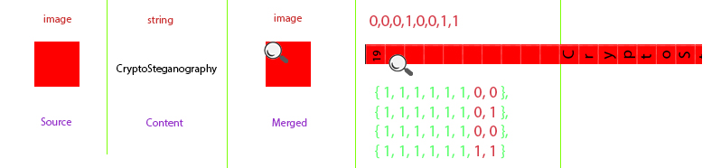

## How do I start


### Merger
```c#
var instance = Steganography
    .Merger
    .SourceType(SteganographyType.Image)
    .Source(new FileInfo("sample/square.bmp"))
    .MergeType(SteganographyType.Text)
    .Content("CryptoSteganography")
    .Merge(new FileInfo("sample/merged/square.txt.bmp"));
```

### Separator
```c#
var instance = Steganography
    .Separator
    .SourceType(SteganographyType.Image)
    .Source(new FileInfo("sample/merged/square.txt.bmp"))
    .SeparateType(SteganographyType.Text)
    .Separate();
```